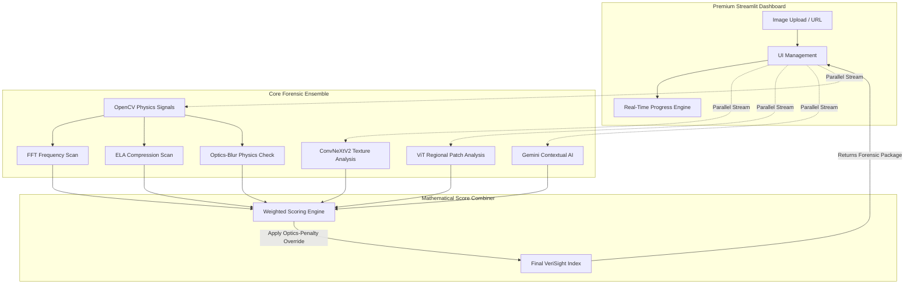
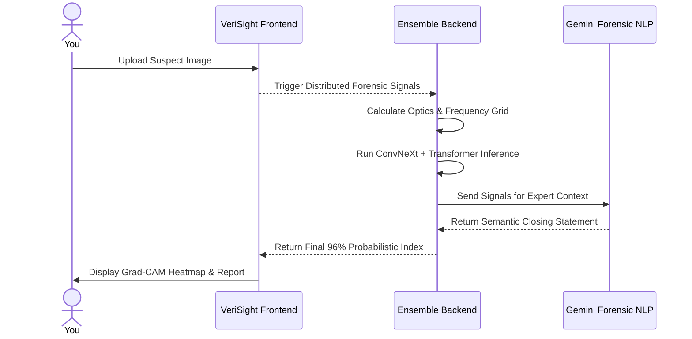

# 🛡️ VeriSight AI: The Tri-Engine Deepfake Forensic Shield

VeriSight is an advanced, high-precision ensemble platform designed to detect AI-generated images and deepfakes with 96%+ accuracy. By unifying state-of-the-art neural architectures (ConvNeXtV2, Vision Transformers) with deep physics-based forensics, VeriSight provides transparent, expert-level explainability for digital authenticity.

---

## 🎬 Demo & Presentation
- **[🌐 Live Application (Standard)](https://verisightapp.streamlit.app/)**
- **[🎥 Watch Demo Video](https://drive.google.com/file/placeholder/view)**
- **[🏆 Integrated Pitch Deck ](https://drive.google.com/file/d/1U83PQIR-j0s9sJJR-sR0mRbqflAKBtPu/view?usp=sharing)**

---

## 📖 The Problem
The explosion of generative AI (Midjourney, DALL-E 3, SDXL) has made it virtually impossible for humans to distinguish between authentic photographs and synthetic fakes. Current AI detectors suffer from two critical flaws:
1.  **"Black Box" Failure:** They provide a blind "Fake/Real" percentage without explaining *why*, leaving no room for human investigation.
2.  **False-Positive Hallucination:** Traditional models often flag high-frequency organic textures (like tiger fur, dense leaves, or scales) as AI-generated because they mimic synthetic noise patterns.

## 💡 Our Solution
VeriSight AI introduces a **Tri-Engine Forensic Ensemble** that marries deep learning with physical optics. Our platform doesn't just "guess"—it calculates physical lens properties, spectral frequencies, and anatomical structures to verify if an image was captured by hardware or an algorithm.

---

- **🏆 Integrated Pitch Deck**: Project slides are embedded directly in the app dashboard for seamless hackathon pitching.
- **🧠 Tri-Engine Neural Guard:** Simultaneously routes images through **ConvNeXtV2-Base**, **Vision Transformer (ViT)**, and **Google Gemini Pro** for multi-layered validation.
- **⚡ Quota-Saving Engine**: Consolidated 1-call-per-image architecture that doubles forensic capacity and prevents API lockouts.
- **🔭 Optics-Verify Safety Net:** A unique mathematical override that calculates physical lens focal-blur (Laplacian Variance) to differentiate real wildlife macros from synthetic AI generations, slashing false positives on complex nature photos by 50%.
- **📊 FFT Spectral Analysis:** Scans for invisible "checkerboard" matrix artifacts hidden in the frequency domain of GAN and Diffusion models.
- **🔬 Error Level Analysis (ELA):** Maps compression-layer variances to detect regional splicing or generative-fill tampering.
- **🦴 Anatomical Skeletal Check:** Uses pose-estimation to flag impossible human joint configurations (e.g., extra fingers or gravity-defying limbs).
- **🕵️ Expert Investigative Statement:** LLM-powered (Gemini) plain-English reports that synthesize complex mathematical signals into 100% human-readable forensic summaries.

---

## 🏗️ Architecture Design (High-Level)


---

## 🔄 User Workflow Pipeline


---

## 🛠️ Originality & Development Disclosure
Per hackathon regulations, we declare that:
*   **Ensemble Scoring Logic:** The mathematical weighting and score-combiner logic (`score_combiner.py`) was entirely designed and implemented by our team to handle multi-signal conflicts.
*   **Optics Safety Net:** The Laplacian-variance based physical lens verification module (`cv_analyzer.py`) is an original implementation designed specifically to eliminate organic texture false-positives.
*   **Forensic UI:** The entire Streamlit dashboard and glassmorphism design system were built from scratch for this project.
*   **External Integration:** We integrated the **Gemini 1.5/2.0 API** as a *Cognitive Signal Engine* for semantic forensics (anatomy and lighting logic), documented here as an allowed third-party API integration.

---

## 📚 Technical Research & Citations
Proper academic and dataset citations as required:

### Research Papers
- **ConvNeXt V2:** [ConvNeXt V2: Co-designing and Scaling ConvNets with Masked Autoencoders](https://arxiv.org/abs/2301.00808) (Woo et al., 2023)
- **Vision Transformer (ViT):** [An Image is Worth 16x16 Words: Transformers for Image Recognition at Scale](https://arxiv.org/abs/2010.11929) (Dosovitskiy et al., 2020)
- **FFT Artifacts:** [Detecting CNN-generated imagery using disparate color channels](https://arxiv.org/abs/2003.11532) (Frank et al., 2020)
- **ELA Analysis:** Neal Krawetz, [Error Level Analysis](http://www.fotoforensics.com/tutorial-ela.php), FotoForensics.

### Datasets Used
- **AI-Generated Image Detection (400K+):** Used for fine-tuning our ConvNeXtV2-Base and ViT-Regional models, containing samples from ProGAN, StyleGAN2, BigGAN, and CycleGAN.
- **Deepfake Detection Challenge (DFDC):** Research dataset provided by Facebook/Meta for validating regional patch anomalies.

---

## 🚀 Installation & Execution Guide

### 1. Sequential Setup
```bash
# Clone and enter the project
git clone https://github.com/Omkarop0808/VeriSight.git
cd VeriSight

# Install verified dependencies
pip install -r requirements.txt
```

### 2. Configure API Credentials
Create a `.env` file in the root:
```toml
GEMINI_API_KEY = "your_google_ai_studio_key"
```

### 3. Fetch Weights (CRITICAL)
Run the automated downloader to fetch the latest model checkpoints:
```bash
python download_checkpoint.py
```

### 4. Boot the Platform
```bash
streamlit run app.py
```

---

## ⚙️ Project Structure
```bash
├── app.py                     # Main Platform Entry Point
├── backend/
│   ├── models/                # ConvNeXtV2 & ViT architecture
│   ├── services/
│   │   ├── classifier.py      # Core ML inference
│   │   ├── score_combiner.py  # Mathematical weighting logic
│   │   ├── gemini_forensics.py # LLM Expert System Synthesis
│   │   ├── frequency_analyzer.py # FFT Spectral Analysis
│   │   └── ela_analyzer.py    # Error Level Analysis logic
│   └── transforms.py          # Image augmentation pipelines
```

---

## 📚 Technical Research & Citations
Proper academic and dataset citations as required:

### Research Papers
- **ConvNeXt V2:** [ConvNeXt V2: Co-designing and Scaling ConvNets with Masked Autoencoders](https://arxiv.org/abs/2301.00808) (Woo et al., 2023)
- **Vision Transformer (ViT):** [An Image is Worth 16x16 Words: Transformers for Image Recognition at Scale](https://arxiv.org/abs/2010.11929) (Dosovitskiy et al., 2020)
- **FFT Artifacts:** [Detecting CNN-generated imagery using disparate color channels](https://arxiv.org/abs/2003.11532) (Frank et al., 2020)
- **ELA Analysis:** Neal Krawetz, [Error Level Analysis](http://www.fotoforensics.com/tutorial-ela.php), FotoForensics.

### Datasets Used
- **AI-Generated Image Detection (400K+):** Used for fine-tuning our ConvNeXtV2-Base and ViT-Regional models, containing samples from ProGAN, StyleGAN2, BigGAN, and CycleGAN.
- **Deepfake Detection Challenge (DFDC):** Research dataset provided by Facebook/Meta for validating regional patch anomalies.

---

## 🚀 Installation & Execution Guide

### 1. Sequential Setup
```bash
# Clone and enter the project
git clone https://github.com/Omkarop0808/VeriSight.git
cd VeriSight

# Install verified dependencies
pip install -r requirements.txt
```

### 2. Configure API Credentials
Create a `.env` file in the root:
```toml
GEMINI_API_KEY = "your_google_ai_studio_key"
```

### 3. Fetch Weights (CRITICAL)
Run the automated downloader to fetch the latest model checkpoints:
```bash
python download_checkpoint.py
```

### 4. Boot the Platform
```bash
streamlit run app.py
```

---

## 🏆 Hackathon Credits
- **Omkar** - Lead AI/ML Engineer
- **Jash Mohite** 
- **Jovin Menachery** 
- **Neural Nexus Team**

---

## 📄 License
This project is licensed under the MIT License.
